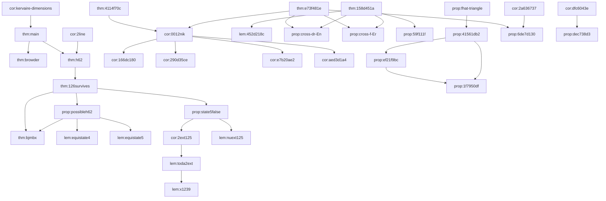

# Draft Dependency Graph

This is a hand-curated first draft of the proof spine for the current blueprint.
It is intentionally smaller than the full `leanblueprint` graph and focuses on the main theorem and the `h_6^2` argument.

Open the generated full graph at `web/dep_graph_document.html` after running `bash build.sh`.
